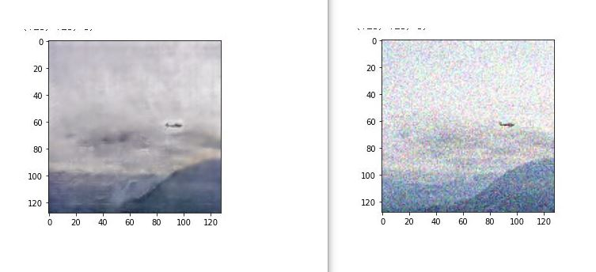
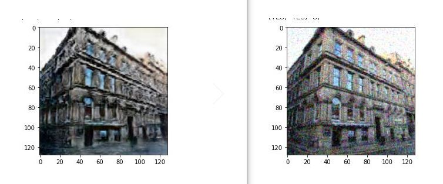
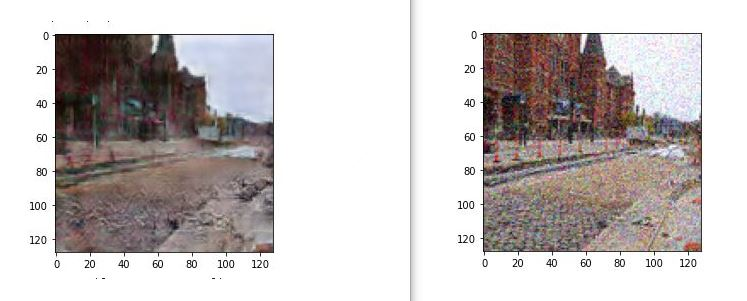
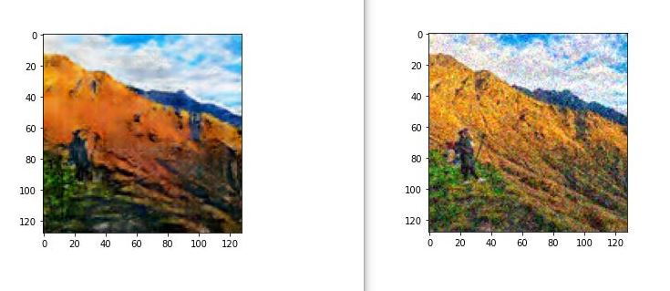
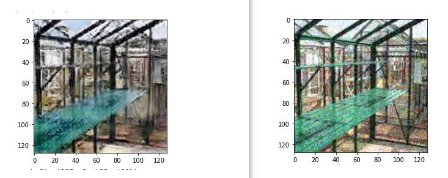
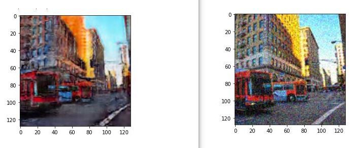
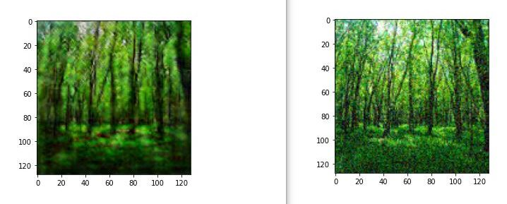

# MPRNET image denoise

## 프로젝트 및 동작 설명

- 이 프로젝트는 컨볼루션 신경망을 이용하여 만든 이미지에서 가우시안 노이즈를 제거하는 프로젝트이다.
- Pytorch GAN 모델을 제작하였다. 

## 결과 사진들 (왼쪽 model output, 오른쪽 노이즈 있는 )

### Requirements
- recommend GoogleColab
